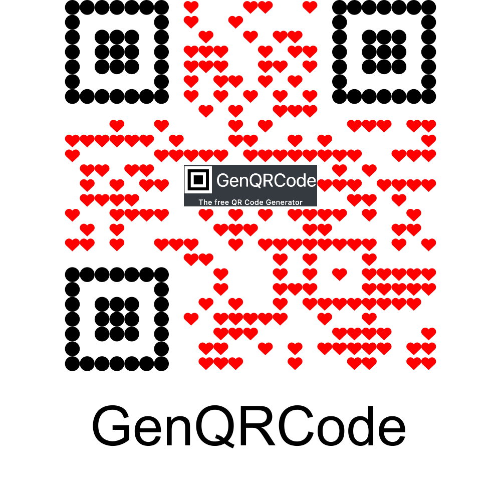

# GenQRCode Java API

## Introduction

The GenQRCode Java API makes it easy to create customizable QR Codes for any purpose. This API is designed to generate customized QR Codes or QR Codes at high speed. The fast algorithms can generate over 10,000 QR Codes per second and will automatically select the optimal QR Code size closest to the specified dimensions.

## Features

- **Full customization** of QR Code style, colors, shapes and images.
- **Formats** such as PNG, SVG, JPEG, EPS, 3MF, STL, OBJ
- **Fast QR Generation** usage of algorithms designed for maximum speed and minimal file size.
- **Batch processing** for multiple QR Codes in a single request.

## Requirements

- Java 8 or higher.

## Installation

## Obtain API Credentials

Create a free account, and obtain your API key at https://genqrcode.com.

## Usage

The main object is `GenQRCodeApi` which can be instantiated with an API key. 
```java
GenQRCodeApi genQRCode = new GenQRCodeApi("{{API-KEY}}");
```
This object contains an executor to send requests to the API and provides functions to create QR Code builders. When the build() function is called, the request is executed asynchronously.

Once finished, you should call the shutdown() function to release resources:

```java
genQRCode.shutdown();
```

### Example of creating a QR Code with customization:
```java
Future<byte[]> qrcode = genQRCode.textQRCode()
        .format(Format.PNG)
        .logo(Logo.from(new File("genqrcode-api/images/example_logo.png")).removeBackground())
        .data(TextQRCodeData.withText("GenQRCode"))
        .frame(TextFrame.TEXT_BELOW.withText("GenQRCode"))
        .squaresShape(SquaresShape.HEARTHS)
        .squareColor(Color.fromRGBA(255, 0,0, 255))
        .innerEyeShape(InnerEyeShape.CIRCLES)
        .outerEyeShape(OuterEyeShape.SMALL_CIRCLES)
        .width(1000)
        .height(1000)
        .build();
byte[] result = fastQRCode.get();
```


```java
FastBatchQRCodeBuilder builder = genQRCode.fastBatchQRCodes();
for (int i = 0; i < 100; i++) {
        builder.addQRCode("QR Code-" + i, genQRCode.fastTextQRCode().format(FastQRFormat.PNG).data(TextQRCodeData.withText("QR Code number: " + i)).getParameters());
}
Future<Map<String, byte[]>> qrcodesFuture = builder.build();
```
Create a map of QR Codes with the name QR Code-0 till QR Code-99 with the values: QR Code number: 0 till QR Code number: 99.

```java
FastBatchQRCodeBuilder builder = genQRCode.fastBatchQRCodes();
for (int i = 0; i < 100; i++) {
        builder.addQRCode("QR Code-" + i, genQRCode.fastTextQRCode().format(FastQRFormat.SVG).data(TextQRCodeData.withText("QR Code number: " + i)).getParameters());
}
Future<byte[]> qrcodesFuture = builder.buildAsZip();
```
Create a zip file containing the QR Codes with the name QR Code-0 till QR Code-99 with the values: QR Code number: 0 till QR Code number: 99.

## Limitations
The API limitations are as follows:

- 180 Customized QR Codes per hour (1 every 20 seconds).
- 9,000 Fast QR Codes per hour (2.5 per second). The cost of a Fast QR Code is 1/50th of a normal QR Code.
These limits are still being validated.

## Support

For help with the SDK, contact [info@genqrcode.com](mailto:info@genqrcode.com).